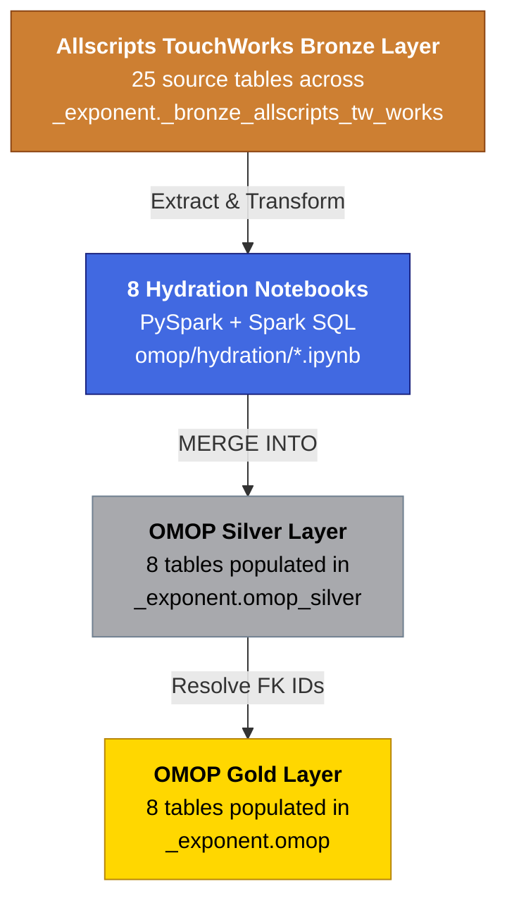
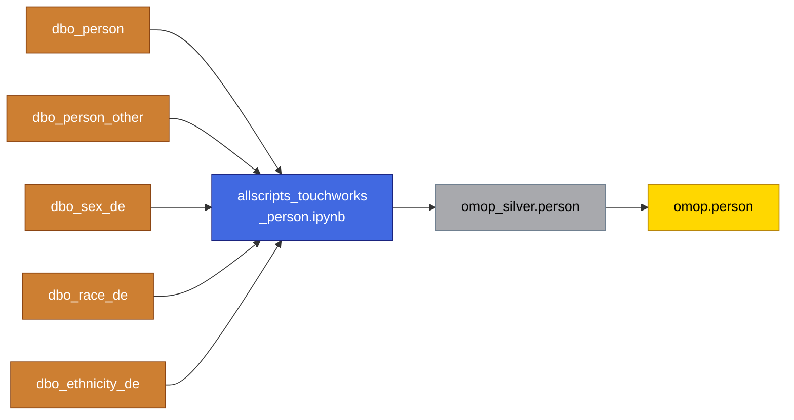
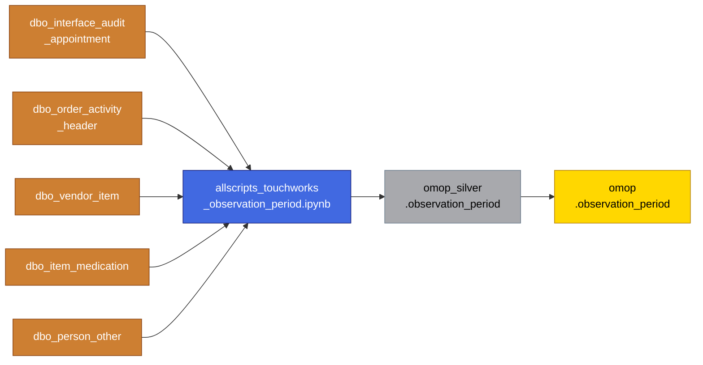
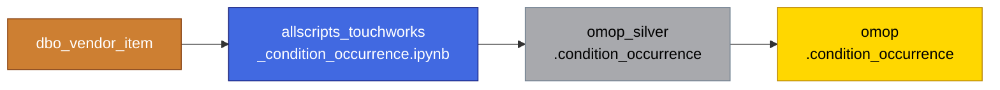
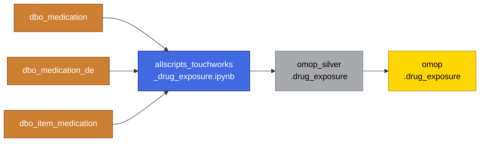
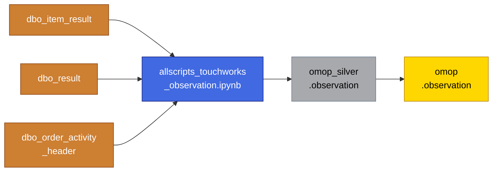
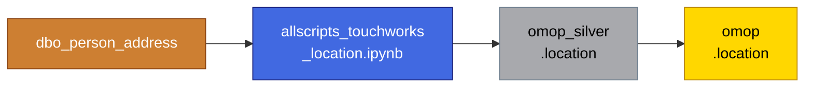
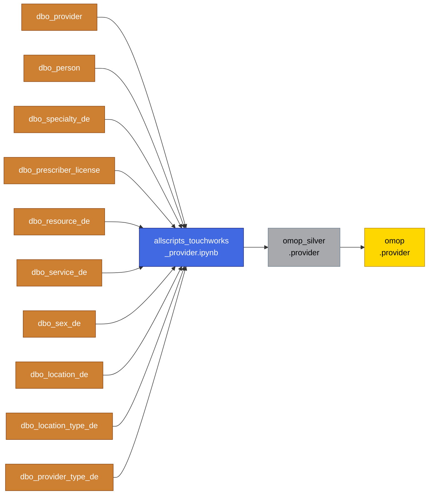

# Allscripts TouchWorks → OMOP CDM Mapping Progress

This document shows the current state of ETL mappings from Allscripts TouchWorks source tables to the OMOP Common Data Model via the medallion architecture (Bronze → Silver → Gold).

---

## Architecture Overview

---

## Detailed Mapping Flows

### 1. Person

> **Concept Mappings:** gender via `dbo_sex_de`, race via `dbo_race_de`, ethnicity via `dbo_ethnicity_de`
> **Known Gaps:** `location_id`, `provider_id`, `care_site_id` are NULL (upstream mapping tables pending)

---

### 2. Observation Period

> **Strategy:** Derives observation period from earliest/latest clinical activity across appointments, orders, conditions, and medications
> **Known Gaps:** None

---

### 3. Visit Occurrence

> **Concept Mappings:** Visit type mapped via `domain_source_to_concept`
> **Known Gaps:** `provider_id`, `care_site_id`, `admitted_from_concept_id`, `discharged_to_concept_id` are NULL

---

### 4. Condition Occurrence

> **Concept Mappings:** SNOMED code → standard OMOP concept via vocabulary; StatusQualifier → `condition_status_concept_id` via `domain_source_to_concept`
> **Known Gaps:** `provider_id`, `visit_occurrence_id`, `visit_detail_id` are NULL

---

### 5. Drug Exposure

> **Concept Mappings:** Drug codes mapped to OMOP standard concepts via vocabulary tables
> **Known Gaps:** `provider_id`, `visit_occurrence_id`, `visit_detail_id` are NULL

---

### 6. Observation

> **Concept Mappings:** Results and findings mapped to OMOP observation concepts
> **Known Gaps:** `value_as_concept_id`, `unit_concept_id`, `provider_id`, `visit_detail_id` are NULL

---

### 7. Location

> **Strategy:** Maps patient addresses to OMOP location table
> **Planned Expansion:** `dbo_pharmacy_de` and `dbo_site_de` are documented as future sources but not yet in the transformation SQL
> **Known Gaps:** None

---

### 8. Provider

> **Concept Mappings:** Specialty mapped via `domain_source_to_concept`; gender via `dbo_sex_de`
> **Known Gaps:** `care_site_id` is NULL (care_site hydration not yet implemented)

---

## Mapping Status Summary

| OMOP Target Table | Source Table Count | Hydration Notebook | Status | Known FK Gaps |
|---|---|---|---|---|
| person | 5 | allscripts_touchworks_person.ipynb | Complete | location_id, provider_id, care_site_id |
| observation_period | 5 | allscripts_touchworks_observation_period.ipynb | Complete | None |
| visit_occurrence | 1 | allscripts_touchworks_visit_occurrence.ipynb | Complete | provider_id, care_site_id |
| condition_occurrence | 1 | allscripts_touchworks_condition_occurrence.ipynb | Complete | provider_id, visit_occurrence_id, visit_detail_id |
| drug_exposure | 3 | allscripts_touchworks_drug_exposure.ipynb | Complete | provider_id, visit_occurrence_id, visit_detail_id |
| observation | 3 | allscripts_touchworks_observation.ipynb | Complete | value_as_concept_id, unit_concept_id, provider_id |
| location | 1 | allscripts_touchworks_location.ipynb | Complete | None |
| provider | 10 | allscripts_touchworks_provider.ipynb | Complete | care_site_id |

---

## Shared Source Tables

Several Allscripts TouchWorks bronze tables feed into multiple OMOP targets:

| Bronze Source Table | Feeds Into |
|---|---|
| dbo_vendor_item | condition_occurrence, observation_period |
| dbo_person_other | person, observation_period |
| dbo_order_activity_header | observation, observation_period |
| dbo_item_medication | drug_exposure, observation_period |
| dbo_person | person, provider |
| dbo_sex_de | person, provider |
| dbo_site_de | provider |

---

## Tables Not Yet Mapped

The following OMOP CDM tables do not yet have Allscripts TouchWorks hydration logic:

| Category | Tables Pending |
|---|---|
| Clinical Core | visit_detail, death |
| Clinical Events | procedure_occurrence, measurement, device_exposure |
| Notes / Specimens | note, note_nlp, specimen |
| Health System | care_site |
| Derived / Era | condition_era, drug_era, dose_era, episode, episode_event |
| Cohort | cohort, cohort_definition, cohort_attribute, attribute_definition |
| Cost / Payer | cost, payer_plan_period, fact_relationship |
| Metadata | cdm_source, metadata |
| Mapping | source_to_concept_map |

> **Note:** Vocabulary tables (concept, concept_class, concept_relationship, concept_synonym, domain, drug_strength, relationship, vocabulary) are loaded separately from OMOP Athena CSV files and are not part of the Allscripts TouchWorks mapping scope.
