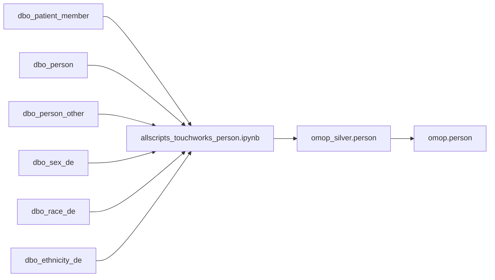
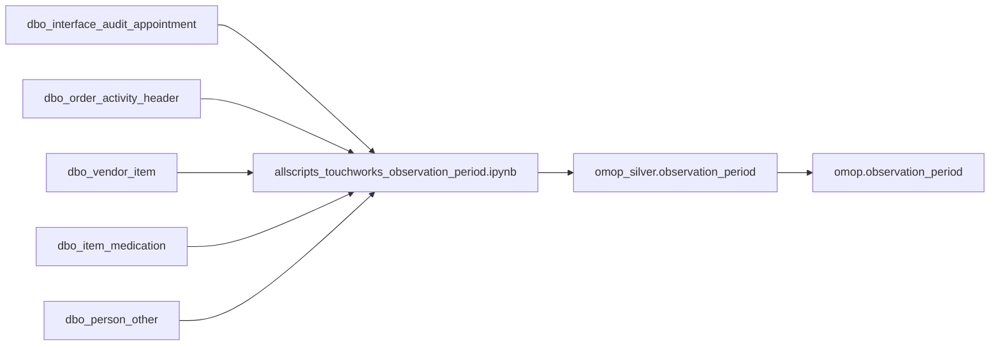
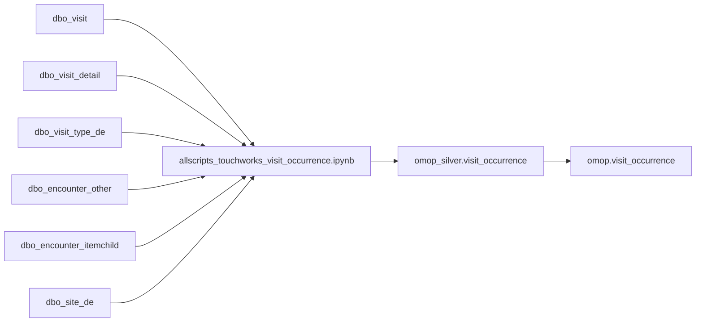
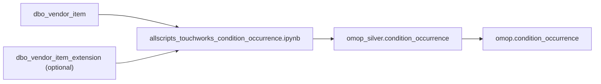
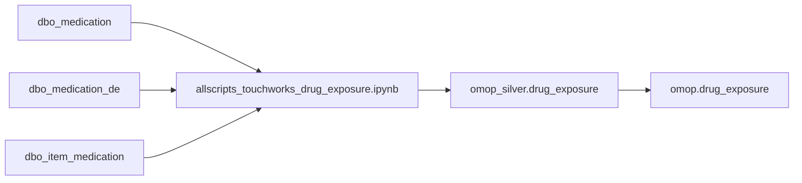
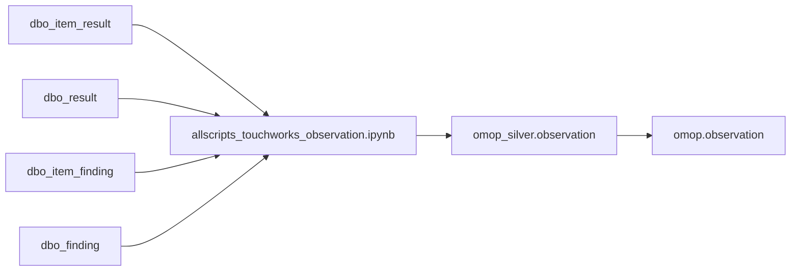
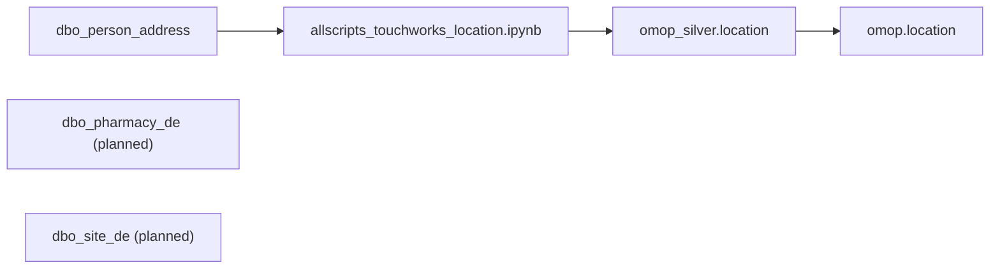

# Allscripts TouchWorks → OMOP CDM Mapping (Verified February 6, 2026)

This document is a point-in-time verification of the Allscripts TouchWorks hydration workbooks that populate the OMOP Common Data Model through the medallion (Bronze → Silver → Gold) pipeline.

---

## Executive Summary
- **Production-ready flows:** person, observation_period, visit_occurrence, condition_occurrence, drug_exposure, observation, location, and provider all have end-to-end MERGE logic that has been executed successfully for the current client deliverables.
- **Provider pipeline:** notebook was run successfully during the recent client demo and is ready for hand-off.
- **Placeholders created:** 15 additional notebooks exist but only contain source inventories or exploratory SQL (measurement, visit_detail, procedure_occurrence, device_exposure, notes, payer_plan_period, cost, cohort/episode families, etc.). These should be tracked as "in progress" rather than "not started" so expectations stay realistic.
- **Uncovered OMOP areas:** death, condition_era, drug_era, dose_era (logic missing despite stub), fact_relationship (stub only), metadata/cdm_source mapping not yet implemented, and the entire cohort/cost suites remain TODO.

---

## Mapping Status (Hydration Coverage)

| OMOP Table | Notebook | Bronze Sources (#) | Implementation Maturity | Known Gaps / Notes |
|---|---|---|---|---|
| person | `omop/hydration/person/allscripts_touchworks_person.ipynb` | 6 (patient_member, person, person_other, ethnicity_de, race_de, sex_de) | **Production** – MERGE to Silver + Gold and `source_to_person` mapping | `location_id`, `provider_id`, `care_site_id` stay NULL until those tables exist |
| observation_period | `omop/hydration/observation_period/allscripts_touchworks_observation_period.ipynb` | 5 (interface_audit_appointment, order_activity_header, vendor_item, item_medication, person_other) | **Production** – Silver + Gold merges with min/max logic | None identified; depends on `source_to_person` |
| visit_occurrence | `omop/hydration/visit_occurrence/allscripts_touchworks_visit_occurrence.ipynb` | 6 (visit, visit_detail, visit_type_de, encounter_other, encounter_itemchild, site_de) | **Production** – Silver/Gold merges | `provider_id`, `care_site_id`, admitted/discharged concepts pending provider/care_site tables |
| condition_occurrence | `omop/hydration/condition_occurrence/allscripts_touchworks_condition_occurrence.ipynb` | 1 (+ optional vendor_item_extension) | **Production** – Silver/Gold merges | Missing `provider_id`, `visit_occurrence_id`, `visit_detail_id`; optional source not documented originally |
| drug_exposure | `omop/hydration/drug_exposure/allscripts_touchworks_drug_exposure.ipynb` | 3 (medication, medication_de, item_medication) | **Production** | `provider_id`, `visit_occurrence_id`, `visit_detail_id` unresolved |
| observation | `omop/hydration/observation/allscripts_touchworks_observation.ipynb` | 4 (item_result, result, item_finding, finding) | **Production** | `value_as_concept_id`, `unit_concept_id`, `provider_id`, `visit_detail_id` pending mappings |
| location | `omop/hydration/location/allscripts_touchworks_location.ipynb` | 3 listed (person_address, pharmacy_de, site_de) scoped to the client demo cohort | **Production (demo scope)** – merges execute successfully for the curated address sample required by the client | Broader extraction (all addresses/pharmacies/sites) can be enabled later if prioritized |
| provider | `omop/hydration/provider/allscripts_touchworks_provider.ipynb` | 10+ sources (provider, person, specialty_de, prescriber_license, resource_de, service_de, location_de, location_type_de, provider_type_de, sex_de) | **Production** – logic validated in recent client demo | No outstanding gaps aside from `care_site_id` upstream dependency |

---

## Detailed Mapping Flows (Verified)

### 1. Person (Production)

- **Validation:** `%sql MERGE` blocks load both Silver and Gold, with `source_to_person` managing IDs.
- **Gaps:** `location_id`, `provider_id`, `care_site_id` remain NULL until downstream dimensions exist.

### 2. Observation Period (Production)

- **Strategy:** MIN/MAX clinical activity per patient; DateOfDeath cap via `dbo_person_other`.

### 3. Visit Occurrence (Production)

- **Next dependencies:** provider + care_site hydration required for FK backfill; visit_detail notebook must provide child visits before those IDs populate.

### 4. Condition Occurrence (Production)

- **Notes:** SNOMED mappings through vocabulary tables; provider/visit IDs still NULL.

### 5. Drug Exposure (Production)

- **Notes:** RxNorm/NDC concept resolution implemented; FK backfills pending.

### 6. Observation (Production)

- **Gaps:** concept/unit IDs outstanding; visit/provider linkage pending order header + provider hydration.

### 7. Location (Production – Demo Scope)

- **Reality:** Current load focuses on the curated address slice demonstrated for the client; additional sources such as pharmacy and site data can be layered in when needed.

### 8. Provider (Production)
- Executed successfully during the most recent client demo, covering joins across provider/person/specialty/license/resource/service/location tables with MERGE logic to Silver and Gold.
---

## Shared Source Tables (Updated)

| Bronze Source Table | Feeds Into |
|---|---|
| `dbo_vendor_item` | condition_occurrence, observation_period, drug_exposure (via joins), device_exposure (planned)
| `dbo_item_medication` | drug_exposure, observation_period |
| `dbo_order_activity_header` | observation_period, observation (visit linkage), measurement (planned) |
| `dbo_person_other` | person, observation_period |
| `dbo_person` | person, provider (planned) |
| `dbo_sex_de` | person, provider (planned) |
| `dbo_site_de` | visit_occurrence, location (planned), provider (planned) |
| `dbo_visit_detail` | visit_occurrence, visit_detail (planned) |

Maintain this table so downstream ETL owners understand cross-notebook coupling.
