# OMOP CDM v5.4 Entity Relationship Diagrams

This document contains ERDs for the OMOP Common Data Model v5.4, organized by category for easier viewing.

---

## 0. Databricks Hydration Flow (Source → OMOP)

```mermaid
flowchart LR

%% ======================
%% 1. CORE TABLES
%% ======================

subgraph Source_Systems
    tw_person[TW PERSON]
    scm_person[SCM PERSON]
    epic_person[EPIC PERSON]

    tw_visit[TW VISIT]
    scm_visit[SCM VISIT]
    epic_visit[EPIC VISIT]
end

subgraph Mapping_Tables
    map_person[PERSON MAPPING]
    map_domain[DOMAIN MAPPING]
end

subgraph Notebooks
    nb_person[nb_person]
    nb_visit[nb_visit]
    nb_obs[nb_observation]
    nb_drug[nb_drug_exposure]
    nb_proc[nb_procedure_occurrence]
    nb_meas[nb_measurement]
    nb_device[nb_device_exposure]
    nb_death[nb_death]
    nb_note[nb_note]
    nb_provider[nb_provider]
    nb_location[nb_location]
end

subgraph OMOP
    PERSON
    VISIT_OCCURRENCE
    VISIT_DETAIL
    OBSERVATION
    DRUG_EXPOSURE
    PROCEDURE_OCCURRENCE
    MEASUREMENT
    DEVICE_EXPOSURE
    DEATH
    NOTE
    PROVIDER
    LOCATION
end

%% ======================
%% PERSON
%% ======================

tw_person --> nb_person
scm_person --> nb_person
epic_person --> nb_person
map_person --> nb_person
nb_person --> PERSON

%% ======================
%% VISIT
%% ======================

tw_visit --> nb_visit
scm_visit --> nb_visit
epic_visit --> nb_visit
nb_visit --> VISIT_OCCURRENCE
nb_visit --> VISIT_DETAIL

%% ======================
%% OBSERVATION
%% ======================

tw_visit --> nb_obs
scm_visit --> nb_obs
epic_visit --> nb_obs
map_domain --> nb_obs
nb_obs --> OBSERVATION

%% ======================
%% DRUG EXPOSURE
%% ======================

%% -------- TW --------
tw_med[TW dbo_medication]
tw_med_de[TW dbo_medication_de]
tw_item_med[TW dbo_item_medication]

tw_med --> nb_drug
tw_med_de --> nb_drug
tw_item_med --> nb_drug

%% -------- SCM --------
scm_order[SCM dbo_cv3order - Medication]
scm_medext[SCM dbo_cv3medicationextension]
scm_generic[SCM dbo_sxammgenericitem - RxNorm]

scm_order --> nb_drug
scm_medext --> nb_drug
scm_generic --> nb_drug

%% -------- EPIC --------
epic_order_med[EPIC ORDER_MED]
epic_med_sig[EPIC ORDER_MED_SIG]
epic_med_master[EPIC CLARITY_MEDICATION]

epic_order_med --> nb_drug
epic_med_sig --> nb_drug
epic_med_master --> nb_drug

%% -------- MAPPING --------
map_domain --> nb_drug
map_person --> nb_drug

%% -------- OUTPUT --------
nb_drug --> DRUG_EXPOSURE

%% ======================
%% PROCEDURE OCCURRENCE
%% ======================

%% -------- TW --------
tw_charge[TW dbo_charge]
tw_charge_code[TW dbo_charge_code_de]
tw_item_result[TW dbo_item_result]
tw_order_activity[TW dbo_order_activity_header]

tw_charge --> nb_proc
tw_charge_code --> nb_proc
tw_item_result --> nb_proc
tw_order_activity --> nb_proc

%% -------- EPIC --------
epic_order_proc[EPIC order_proc]
epic_or_log[EPIC or_log]

epic_order_proc --> nb_proc
epic_or_log --> nb_proc

%% -------- SCM --------
scm_proc_placeholder[SCM procedure tables - not available]

scm_proc_placeholder --> nb_proc

%% -------- MAPPING --------
map_domain --> nb_proc
map_person --> nb_proc

%% -------- OUTPUT --------
nb_proc --> PROCEDURE_OCCURRENCE

%% ======================
%% MEASUREMENT
%% ======================

%% -------- TW --------
tw_item_result[TW dbo_item_result]
tw_result[TW dbo_result]
tw_order_activity[TW dbo_order_activity_header]

tw_item_result --> nb_meas
tw_result --> nb_meas
tw_order_activity --> nb_meas

%% -------- SCM --------
scm_obs[SCM dbo_cv3observationcur]
scm_order_task[SCM dbo_cv3ordertaskoccurrence]

scm_obs --> nb_meas
scm_order_task --> nb_meas

%% -------- EPIC --------
epic_order_results[EPIC order_results]
epic_flowsheet[EPIC V_EHI_FLO_MEAS_EDITED]

epic_order_results --> nb_meas
epic_flowsheet --> nb_meas

%% -------- MAPPING --------
map_domain --> nb_meas
map_person --> nb_meas

%% -------- OUTPUT --------
nb_meas --> MEASUREMENT

%% ======================
%% DEVICE EXPOSURE
%% ======================

%% -------- TW --------
tw_charge_device[TW dbo_charge]
tw_charge_code_device[TW dbo_charge_code_de]
tw_visit_device[TW dbo_visit]

tw_charge_device --> nb_device
tw_charge_code_device --> nb_device
tw_visit_device --> nb_device

%% -------- SCM --------
scm_device_placeholder[SCM device exposure - not provided yet]

scm_device_placeholder --> nb_device

%% -------- EPIC --------
epic_or_imp[EPIC or_imp]

epic_or_imp --> nb_device

%% -------- MAPPING --------
map_domain --> nb_device
map_person --> nb_device

%% -------- OUTPUT --------
nb_device --> DEVICE_EXPOSURE

%% ======================
%% DEATH
%% ======================

%% -------- TW --------
tw_person[TW dbo_person]
tw_person_other[TW dbo_person_other]

tw_person --> nb_death
tw_person_other --> nb_death

%% -------- SCM --------
scm_client[SCM dbo_cv3client]

scm_client --> nb_death

%% -------- EPIC --------
epic_patient[EPIC patient]

epic_patient --> nb_death

%% -------- MAPPING --------
map_person --> nb_death

%% -------- OUTPUT --------
nb_death --> DEATH

%% ======================
%% NOTE
%% ======================

%% -------- TW --------
tw_oah[TW dbo_order_activity_header]
tw_order_mapper[TW dbo_order_result_mapper]
tw_result_text[TW dbo_result_text]

tw_oah --> nb_note
tw_order_mapper --> nb_note
tw_result_text --> nb_note

%% -------- SCM --------
scm_obs_note[SCM dbo_scaobservation]
scm_doc[SCM dbo_scadocument]
scm_docdim[SCM dbo_scadocumentdim]
scm_client_note[SCM dbo_cv3client]

scm_obs_note --> nb_note
scm_doc --> nb_note
scm_docdim --> nb_note
scm_client_note --> nb_note

%% -------- EPIC --------
epic_hno[EPIC hno_info]
epic_note_type[EPIC zc_note_type_ip]

epic_hno --> nb_note
epic_note_type --> nb_note

%% -------- MAPPING --------
map_person --> nb_note

%% -------- OUTPUT --------
nb_note --> NOTE

%% ======================
%% PROVIDER
%% ======================

%% -------- TW --------
tw_provider[TW dbo_provider]
tw_person_provider[TW dbo_person]
tw_sex[TW dbo_sex_de]
tw_specialty[TW dbo_specialty_de]

tw_provider --> nb_provider
tw_person_provider --> nb_provider
tw_sex --> nb_provider
tw_specialty --> nb_provider

%% -------- SCM --------
scm_careprovider[SCM dbo_cv3careprovider]
scm_careproviderid[SCM dbo_cv3careproviderid]

scm_careprovider --> nb_provider
scm_careproviderid --> nb_provider

%% -------- EPIC --------
epic_clarity_ser[EPIC clarity_ser]

epic_clarity_ser --> nb_provider

%% -------- MAPPING --------
map_domain --> nb_provider

%% -------- OUTPUT --------
nb_provider --> PROVIDER

%% ======================
%% LOCATION
%% ======================

%% -------- TW --------
tw_person_address[TW dbo_person_address]

tw_person_address --> nb_location

%% -------- SCM --------
scm_address[SCM dbo_cv3address]

scm_address --> nb_location

%% -------- EPIC --------
epic_patient_addr[EPIC patient]

epic_patient_addr --> nb_location

%% -------- MAPPING --------
map_domain --> nb_location

%% -------- OUTPUT --------
nb_location --> LOCATION
```

## 2. Clinical Events Tables

Tables that capture clinical events during patient visits.

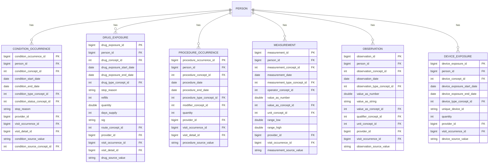

## 3. Notes and Specimens

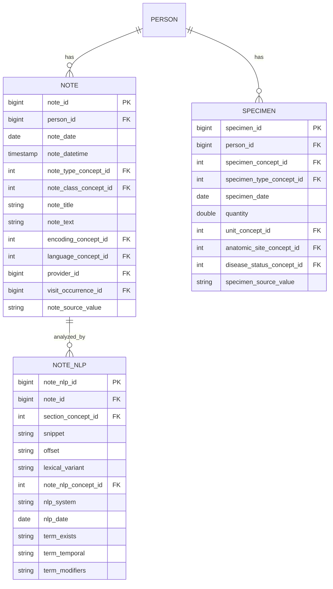

---

## 4. Health System Tables

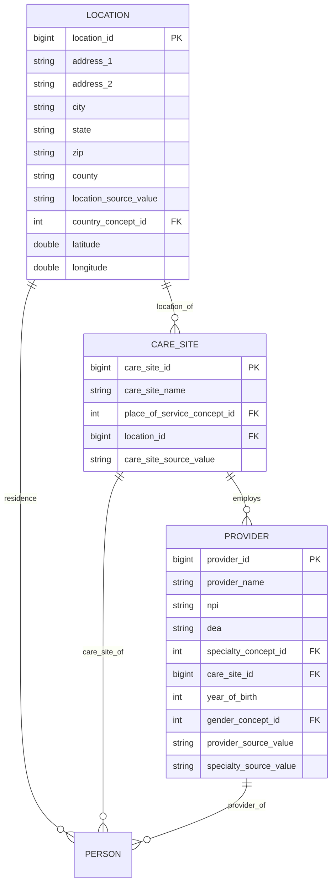

---

## 5. Vocabulary Tables

The standardized vocabulary system - CONCEPT is the central hub.

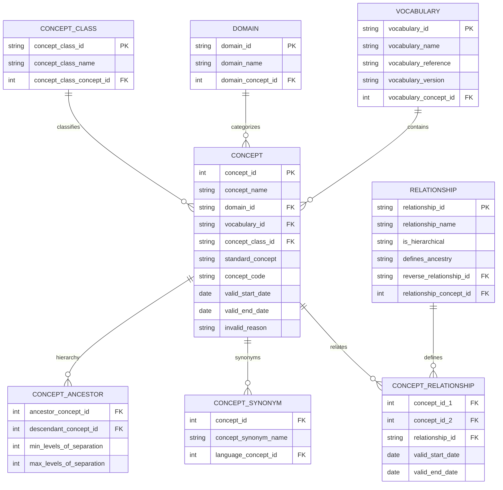

---

## 6. Mapping and Drug Strength Tables

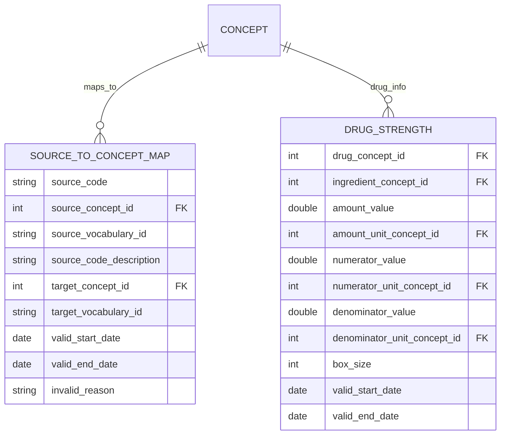

---

## 7. Derived / Era Tables

Aggregated tables derived from occurrence data.

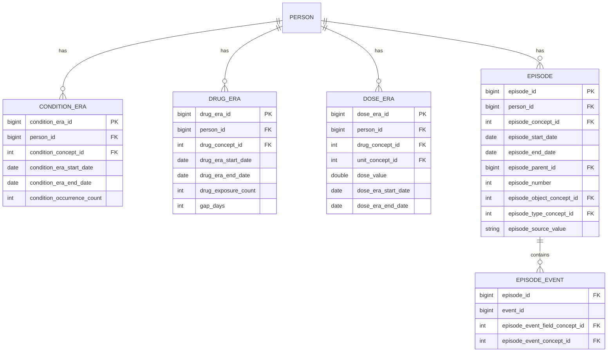

---

## 8. Cohort Tables

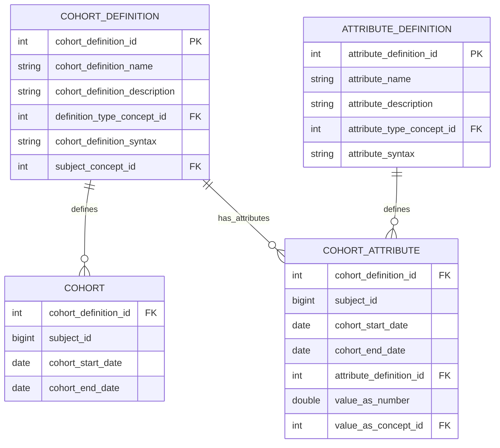

---

## 9. Cost / Payer Tables

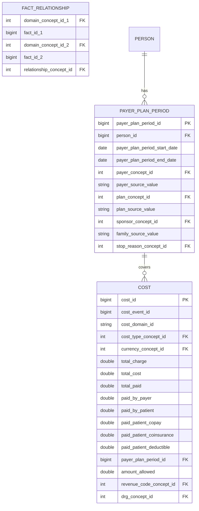

---

## 10. Metadata Tables

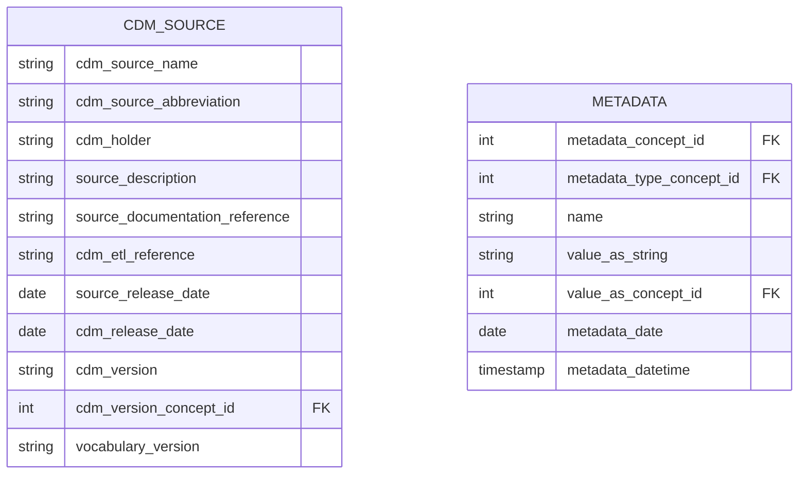

---

## Table Summary

| Category        | Tables                                                                                                  | Count |
| --------------- | ------------------------------------------------------------------------------------------------------- | ----- |
| Clinical Core   | person, observation_period, visit_occurrence, visit_detail, death                                       | 5     |
| Clinical Events | condition_occurrence, drug_exposure, procedure_occurrence, device_exposure, measurement, observation    | 6     |
| Notes/Specimens | note, note_nlp, specimen                                                                                | 3     |
| Health System   | location, care_site, provider                                                                           | 3     |
| Vocabulary      | concept, vocabulary, domain, concept_class, concept_relationship, relationship, concept_synonym, concept_ancestor | 8     |
| Mapping         | source_to_concept_map, drug_strength                                                                    | 2     |
| Derived/Era     | condition_era, drug_era, dose_era, episode, episode_event                                               | 5     |
| Cohort          | cohort, cohort_definition, cohort_attribute, attribute_definition                                       | 4     |
| Cost/Payer      | cost, payer_plan_period, fact_relationship                                                              | 3     |
| Metadata        | cdm_source, metadata                                                                                    | 2     |
| **Total**       |                                                                                                         | **41** |

---

## High-Level Overview

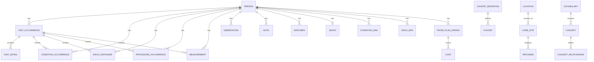
