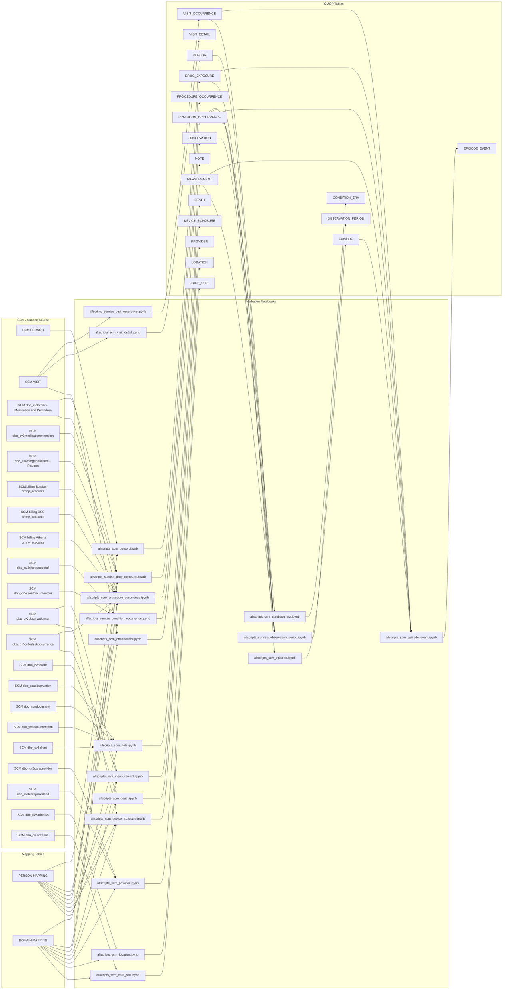
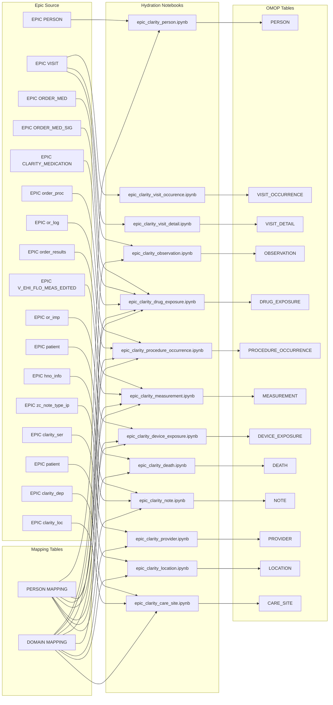

# OMOP Source System Diagrams

## Mapping Layer Overview:  

Source Data = Raw clinical inputs  

Person Mapping = Standardize patient identity → Map source IDs to OMOP person_id  

Domain Mapping = Determine data type → Route to appropriate OMOP table  

Notebooks = Apply logic and load to OMOP

## TouchWorks → OMOP

```mermaid
flowchart LR

subgraph SOURCE[TouchWorks Source]
    tw_person[TW PERSON]
    tw_visit[TW VISIT]
    tw_med[TW dbo_medication]
    tw_med_de[TW dbo_medication_de]
    tw_item_med[TW dbo_item_medication]
    tw_charge[TW dbo_charge]
    tw_charge_code[TW dbo_charge_code_de]
    tw_item_result_proc[TW dbo_item_result]
    tw_order_activity[TW dbo_order_activity_header]
    tw_item_result_meas[TW dbo_item_result]
    tw_result[TW dbo_result]
    tw_order_activity_meas[TW dbo_order_activity_header]
    tw_charge_device[TW dbo_charge]
    tw_charge_code_device[TW dbo_charge_code_de]
    tw_visit_device[TW dbo_visit]
    tw_person_death[TW dbo_person]
    tw_person_other[TW dbo_person_other]
    tw_oah[TW dbo_order_activity_header]
    tw_order_mapper[TW dbo_order_result_mapper]
    tw_result_text[TW dbo_result_text]
    tw_provider[TW dbo_provider]
    tw_person_provider[TW dbo_person]
    tw_sex[TW dbo_sex_de]
    tw_specialty[TW dbo_specialty_de]
    tw_person_address[TW dbo_person_address]
    tw_billing_loc[TW dbo_billing_location_de]
    tw_location_de[TW dbo_location_de]
    tw_site_de[TW dbo_site_de]
    tw_site_loc[TW dbo_site_location_de]
end

subgraph MAP[Mapping Tables]
    map_person[PERSON MAPPING]
    map_domain[DOMAIN MAPPING]
end

subgraph NB[Hydration Notebooks]
    nb_person[allscripts_touchworks_person.ipynb]
    nb_visit_occ[allscripts_touchworks_visit_occurrence.ipynb]
    nb_visit_detail[allscripts_touchworks_visit_detail.ipynb]
    nb_obs[allscripts_touchworks_observation.ipynb]
    nb_drug[allscripts_touchworks_drug_exposure.ipynb]
    nb_proc[allscripts_touchworks_procedure_occurrence.ipynb]
    nb_meas[allscripts_touchworks_measurement.ipynb]
    nb_device[allscripts_touchworks_device_exposure.ipynb]
    nb_death[allscripts_touchworks_death.ipynb]
    nb_note[allscripts_touchworks_note.ipynb]
    nb_provider[allscripts_touchworks_provider.ipynb]
    nb_location[allscripts_touchworks_location.ipynb]
    nb_care_site[allscripts_touchworks_care_site.ipynb]
end

subgraph OMOP[OMOP Tables]
    PERSON
    VISIT_OCCURRENCE
    VISIT_DETAIL
    OBSERVATION
    DRUG_EXPOSURE
    PROCEDURE_OCCURRENCE
    MEASUREMENT
    DEVICE_EXPOSURE
    DEATH
    NOTE
    PROVIDER
    LOCATION
    CARE_SITE
end

tw_person --> nb_person
map_person --> nb_person
nb_person --> PERSON

tw_visit --> nb_visit_occ
nb_visit_occ --> VISIT_OCCURRENCE

tw_visit --> nb_visit_detail
nb_visit_detail --> VISIT_DETAIL

tw_visit --> nb_obs
map_domain --> nb_obs
nb_obs --> OBSERVATION

tw_med --> nb_drug
tw_med_de --> nb_drug
tw_item_med --> nb_drug
map_domain --> nb_drug
map_person --> nb_drug
nb_drug --> DRUG_EXPOSURE

tw_charge --> nb_proc
tw_charge_code --> nb_proc
tw_item_result_proc --> nb_proc
tw_order_activity --> nb_proc
map_domain --> nb_proc
map_person --> nb_proc
nb_proc --> PROCEDURE_OCCURRENCE

tw_item_result_meas --> nb_meas
tw_result --> nb_meas
tw_order_activity_meas --> nb_meas
map_domain --> nb_meas
map_person --> nb_meas
nb_meas --> MEASUREMENT

tw_charge_device --> nb_device
tw_charge_code_device --> nb_device
tw_visit_device --> nb_device
map_domain --> nb_device
map_person --> nb_device
nb_device --> DEVICE_EXPOSURE

tw_person_death --> nb_death
tw_person_other --> nb_death
map_person --> nb_death
nb_death --> DEATH

tw_oah --> nb_note
tw_order_mapper --> nb_note
tw_result_text --> nb_note
map_person --> nb_note
nb_note --> NOTE

tw_provider --> nb_provider
tw_person_provider --> nb_provider
tw_sex --> nb_provider
tw_specialty --> nb_provider
map_domain --> nb_provider
nb_provider --> PROVIDER

tw_person_address --> nb_location
map_domain --> nb_location
nb_location --> LOCATION

tw_billing_loc --> nb_care_site
tw_location_de --> nb_care_site
tw_site_de --> nb_care_site
tw_site_loc --> nb_care_site
map_domain --> nb_care_site
nb_care_site --> CARE_SITE
```

---

## SCM / Sunrise → OMOP

---

## Epic → OMOP

